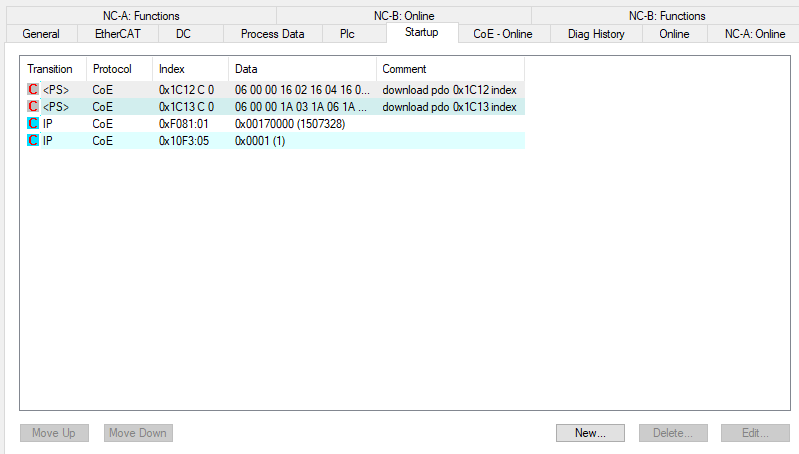
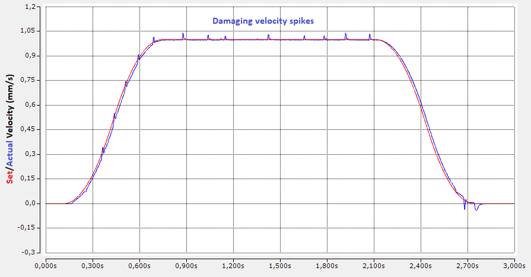

====================================
Motor Tuning with EL7342 - Procedure
====================================

Velocity Control Loop Tuning
============================

With the motor configuration set, the YT Scope project ready, we can now focus on the tuning part of the procedure.

The Velocity Control Loop will be managed by the EL7342, the input velocity is managed by the NC. We will first focus on the EL7342 tuning.

.. warning:: 

   REMINDER :  you  The tuning can be affected by the cycle time associated to the NC. It is recommended  to set this task to 1 ms before any tuning,  for better results and less oscillations.  Go to the "Motor and software configuration" chapter II part 1 to set the correct cycle time.

Configurating the Mode
----------------------

To have our EL7342 working as a velocity control loop, we have to setup some parameters in the Process Data and the CoE Online. Left click on the right Terminal EL7342 (if you have multiple), and go in the Process Data window.

   Needed Process Data are automaticaly chosen when selecting Velocity control compact with info data

In the Predefined PDO Assignment, select the Velocity control compact with info data. It will turn on all the PDO assignment needed for velocity control  plus the PDO needed for the info data which can be assigned, for instance, to the curent command.

   
   Operation Mode shall be automatic (will follow the PDO assignment)  

In the CoE Online window, look for the Operation mode located in either 8022:01 register if you are using the Channel 1, or 8032:01 if you use the Channel 2. Set the mode to Automatic. In this mode, the EL7342 will automatically be set to the Velocity Control Compact with info data that has been set in the process data.
Activate the new configuration with |activate|  

Tuning with Ziegler-Nichols
---------------------------

To tune our motor, we will be using the Ziegler-Nichols method. In the CoE Online, at the register 8023:0 or 8033:0 depending on the channel used, you will find the Kp, Ki and Kd factor of the velocity control loop. Respectively, 8023:01 8023:02 and 8023:08 (or 8033:01 8033:02 and 8033:08 if channel 2 is used).

   

**Start by setting both Ki and Kd to 0.**

The Ziegler-Nichols method's first step is to find the gain Kp ultimate to which the motor is no longer stable, and start oscillating. 
Increase the Kp factor, **to update the changes, disable and enable again the controller on the NC panel.**

    Enable and Disable control in order to update changes in CoE Online assignment. (it might be a better way ?) 

.. warning:: 

    Reminder : A shortcut to the NC panel and NC functions is available on the EL7342 window.
    Common problem : Sometimes, enabling controller by clicking on it will not actually enable the motion. Click instead on All to fix the issue.
    Disabling the motion while the motor is moving will send the Error 16992 (0x4260), click on the Reset button F8 of the NC panel to reset it

Once the changes are updated, go in the function panel :

    
    The Velo step Sequence is necessary to bypass the NC position control loop   

Use the Velo Step Sequence function to send velocity commands to the motor. **This function is the only way to send a Velocity command directly to the module velocity control loop.  Other functions go through the position control loop of the NC and thus, will change the gain Kp ultimate.**

The velocity command is sent to the EL7342 through a 16 bits integer (with one bit for the sign). The NC task is using the reference velocity parameter to scale the input velocity (in user units) to the 16 bits velocity command :
e.g. if the reference velocity is 2 mm/s and a command of 1mm/s is triggered, the NC task will send a command of  :math:`2^{15}/2 = 16384` . 

Create a YT chart to display both the actual velocity and the set velocity to visualize your motor's behavior.

.. _scope_vel:

    *Actual Velocity* (blue)  and *Set Velocity* (green) in mm/s of an oscillating motor M112-2DG1 on a YT Chart on a Velo Step Sequence function

In our example, the motor started being unstable at Kp = 1200. Our gain Kp ultimate (Ku) is 1200.
Using the YT Chart, zoom on the oscillations to measure the oscillation frequency.
Reminder : Use the zoom tool to zoom on the oscillations and click it once to do an automatic Y zoom !

   Zoomed in  *Actual Velocity* (blue)  and *Set Velocity* (green) in mm/s of an oscillating motor M112-2DG1 on a YT Chart on a Velo Step Sequence function

.. tip::
   
    You can click on the the tip of two oscillations to read the time t !

In our example, the period time Tu of the oscillations is 18 ms.

With both our Ku and Tu known, we can calculate the optimal parameters for our controller.
Using the same spreadsheet as previously, we can enter our two Ku and Tu values to automatically obtain our correctors gain with the proper units. (EL7342's units are a bit a mess to understand)

`Motor Tuning with EL7342 - Google Sheets  <https://docs.google.com/spreadsheets/d/1AWgOfwWHZM1icJWqUJhcqb1S85XH-hp5tlnLiJ5IdK0/edit#gid=2072590852>`_ 

.. warning:: 

     It seems that the control loop of the EL7342 is slightly more complicated than a pure P, PI or PID. For instance with a Ki set to zero (no integrator) the transfer function is not the one expected for a pure proportional:  the static error is compensated in some ways. However with an integrator and derivative (PI, & PID) the transfert function is very similar to its theoretical counterpart

    
    Spreadsheet screenshot
    
In our example, the spreadsheet calculates the values above. We will choose to use a PID controller. (the EL7342's PI only controller is not a perfect PI and seems to compensate things around.)
The Ziegler-Nichols method gives us the following configuration on our velocity control loop :

    
    EL7342 Control parameters for this exmemple 

And the final tuning results gives the following behavior :

    
    *Actual Velocity* (blue) and *Set Velocity* (red) (mm/s) of a correctly tuned motor M112-2DG1 on a YT Chart on a Velo Step Sequence function

Improving tuning
----------------

It is possible to have a quite bad tuning easily if the ultimate gain Ku was taken too low or too high. You might encounter oscillating behavior or slow answer.
This part focuses on the common behavior that you can encounter and how to improve them.

A. Small Oscillations 
~~~~~~~~~~~~~~~~~~~~~

   Actual Velocity (blue)  and Set Velocity (red)  (mm/s) of a badly tuned motor M112-2DG1 on a YT Chart on a Velo Step Sequence function

**Symptoms :** 

- Oscillations on the whole answer
- High overshoot (>5%)

**Fix:** 

- Decrease the ultimate gain Ku and update the new factors

B. Slow Answer 
~~~~~~~~~~~~~~

   
   Actual Velocity (blue) and Set Velocity (red)  (mm/s) of a badly tuned motor M112-2DG1 on a YT Chart on a Velo Step Sequence function

**Symptoms :** 

- Low overshoot
- Velocity command reached slowly and lately

**Fix:**

- Increase the ultimate gain Ku and update the new factors

Saving configuration parameters
-------------------------------

Once you've finished tuning your motor, you will need to save your configuration in order to be able to, for example, replace your module EL7342 without losing your configuration.

   Parameters saved in the startup configuration 

In your Terminal EL7342, there is a Startup window that allows you to automatically configurate the registers you want at launch.
By clicking "New", you can add registers that will be configurated everytime you launch your project into the PLC.

   Panel to edit startup parameters 

From here, it works as the CoE Online register configuration method previously used. Configure your **DCM Motor Settings** using the **EL7342 Configuration** page of the spreadsheet and apply your same controllers factors to the **DCM Controller Settings 2**. Do not forget to **set the Operation Mode in the DCM Features register to Automatic !**

To save a parameter, select the register, enter its value and click OK. You will need to repeat this process for each registers.

`Motor Tuning with EL7342 - Google Sheets  <https://docs.google.com/spreadsheets/d/1AWgOfwWHZM1icJWqUJhcqb1S85XH-hp5tlnLiJ5IdK0/edit#gid=2072590852>`_ 

Position Control Loop Tuning
============================

Now that our motor's velocity is controlled and tuned by the EL7342, we can start working on the NC task and its position control loop.
The controller of the NC task is configurated in the Ctrl of our Axis.

Two windows will be interesting for us : The NC-Controller and the Parameter.
The goal of this position control loop is to make the positioning of the motor as accurate as possible. We give it a position command, we want it to get there as precisely as possible and as fast as possible.

Controler Choice
----------------

To complete our precision goal, we will be using the Position controller with two P constants (with Ka) that can be selected in the NC-Controller window.

This controller offers us multiple parameters to setup our position control loop.

Tuning Parameters 
-----------------

To tune our motor, we will be visualizing the changes of our parameters while the motor is moving. To do so, we will start a **Reversing Sequence function** in the Function panel of the NC Task (with idle time).

To tune the different parameters of our position controller, we will be using again the **Ziegler-Nichols method** on a Proportional controller.
We will also need a YT chart with the following data:

- PosDiff : Position error
- ActPos : Actual Position of the motor
- SetPos : Position command sent by the NC task

A Finding the ultimate Gain Ku 
~~~~~~~~~~~~~~~~~~~~~~~~~~~~~~

To find our ultimate gain Ku, we will first use a simple Position controller P. (Don't forget to activate configuration to update the controller used)

The method is the same as the velocity control loop tuning. Increase the Proportional factor Kv of your controller until the motor becomes unstable.

Contrary to the EL7342, you can update the changes by selecting the factor you want to change and click Download while the motor is still moving.

**The definition of instability is different on this case**. We will say that our motor becomes unstable when **its actual velocity will have increasing oscillations either while moving or while standing**.

   
   Actual Velocity (blue) (mm/s), Actual Position (orange)  (mm) and Position Error (violet) (µm) of an oscillating motor M112-2DG1 on a YT Chart on a Reversing Sequence function

A motor unstable with oscillations on its speed during movement.

   Actual Velocity (blue) (mm/s), Actual Position (orange)  (mm) and Position Error (violet) (µm) of an oscillating motor M403-1DG on a YT Chart on a Reversing Sequence function

A motor unstable with **oscillations on its speed** during standstill.

The goal is to find the ultimate gain Ku. Contrary to the velocity control loop, we do not need to find the oscillating period Tu, since we will only be needing a proportional gain, which doesn't depend on the oscillating period.

B Computing tuning Parameters
~~~~~~~~~~~~~~~~~~~~~~~~~~~~~

With the ultimate gain Ku found, we are now able to calculate the correct parameters for our new NC controller. Select the "Position controller with two P constants (with Ka)" controller in the NC-Controller window.

Using the same spreadsheet as before, we can automatically calculate our needed parameters for our position controller, in the "Position Controller" page : 

`Motor Tuning with EL7342 - Google Sheets  <https://docs.google.com/spreadsheets/d/1AWgOfwWHZM1icJWqUJhcqb1S85XH-hp5tlnLiJ5IdK0/edit#gid=2072590852>`_ 

The next steps will use Y marker to have a better view of what's happening with the motor. Check the The YT Scope Project - Electronique et Logiciel Instrumental - WIKI IPAG (osug.fr) chapter to know how to set it up.
Enter your motor's characteristics and apply the automatically calculated parameters to your controller. Don't forget to update the changes using the Activating Configuration button |activate|

    
   scope for a Position control loop tuned 
   
With a well tuned motor, you should now be able to see it stop precisely around the position command given.

Improving tuning
----------------

Some motors, such as small motor as the M112-2DG1 can be harder to tune correctly and get a satisfying position tuning. For that, we have multiple ways to improve our tuning depending on its current behavior.

A Tracking Improvement 
~~~~~~~~~~~~~~~~~~~~~~

It is possible that your motor is having trouble following its position while moving. This is not a huge problem and should not affect your motor's precision while standstill, but it can be easily improved.

   scope to illustrate a following error  

**Symptoms :** 

- High position error when moving
- Position error is far from the set dead band position deviation while moving

**Fix :**
- Increase your ultimate gain Ku and update the new factors until your position error stays around the dead band

B Oscillating Velocity 
~~~~~~~~~~~~~~~~~~~~~~

It is possible that, with a high ultimate gain Ku chosen, the values of your position controller might be too high for your motor, and its velocity can be a bit unstable. These oscillations can cause your motor to get damaged very quickly, shortening its lifespan.
As for bigger motors, finding the ultimate gain Ku can be tricky. As a reminder, the instability of your motor starts as soon as its velocity gets unstable !

   scope to illustrate unstable posiotn control loop  

**Symptoms :**

- Velocity jolts
- Audible shaking during movement

**Fix:** 

- Decrease your ultimate gain Ku and update the new factors

Saving and Loading Configuration
================================

Once you finished tuning and configurating your motors, it is important to save their configuration. It will also be useful, if you need to use the same motors for other applications, since you already have the tuning parameters and configuration for this specific motor.

Saving the NC Axis configuration
--------------------------------

To save your motor's axis configuration, go in the NC-Task folder, right click on your motor's axis and click on Save Axis As. It will generate a .xti file, reusable for other applications.

Loading a NC Axis configuration
-------------------------------

To load a saved Axis configuration, it is extremely simple.

Right click on the Axes folder of the NC-Task, and Add Existing Item. Select your .xti file, and your configurated Axis will appear.

Make sure that the links with your I/O and PLC are still here (if you had links).

Make sure to have the NC-Task cycle time reduced to its minimum value

Saving the EL7342 CoE Online configuration
------------------------------------------

We saw previously how to save in the Startup window of the EL7342 the CoE Online. Here, we will be saving these parameters like we did for the NC-task's Axis.

Right click on the Terminal EL7342, and save Term EL7342 As.

This will generate a .xti file, reusable like the Axis .xti file.

Loading a Terminal EL7342 configuration
---------------------------------------

To load the Terminal EL7342 configuration saved, we will need to have already our devices scanned and present on our I/O folder.

Right click on the Terminal you want to load in the configuration, and insert existing item to add another Terminal EL7342.

You may need to remove the original Terminal EL7342.

And now Activate the configuration |activate|.
You should now be able to use freely your terminal EL7342 with its saved data !

